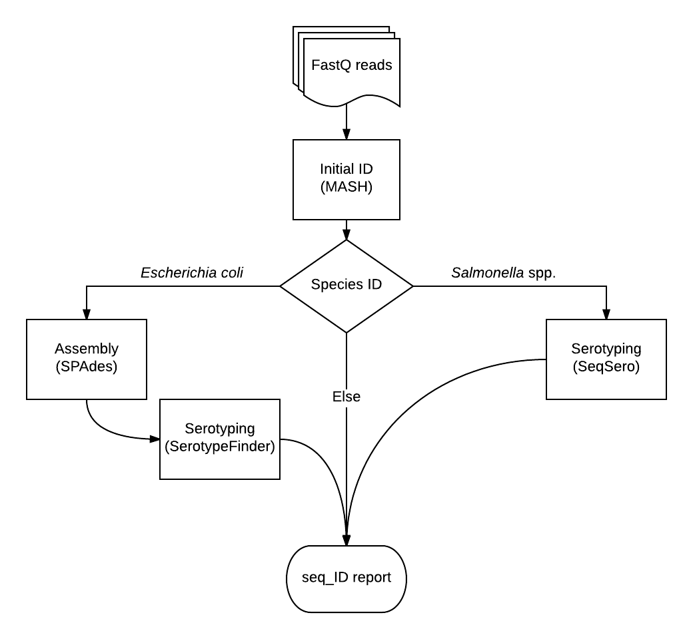

# Seq_ID
A bioinformatics pipeline for organism identification and sample-label verification of whole genome sequence (WGS) data produced at the DCLS


##Rationale 


The DCLS is in need for a quality assurance pipeline to verify sample ID labels prior to publishing sequence data. 


## Data workflow:


Seq_ID uses [MASH](http://genomebiology.biomedcentral.com/articles/10.1186/s13059-016-0997-x), a fast genome distance estimation algorithm, to determine the taxonomic identitity of all isolates; MASH is capable of accurate identification up to the species level. This level of resolution will suffice for organisms other than \**Salmonella* spp. and *Escherichia coli* isolates.

For *Salmonella* spp. and *Escherichia coli* isolates, serotype is determined through [SeqSero](http://jcm.asm.org/content/early/2015/03/05/JCM.00323-15) and [SerotypeFinder](http://jcm.asm.org/content/53/8/2410.full.pdf+html), respectively. 

All results are compiled into a single seq\_ID report. This report can be accessed by WGS scientists to compare molecular typing results of each sample; significant incongruences are assumed to be a result of mislabeling. 

---

<sup>\*The majority of isolates sequenced at the DCLS are *Salonella* spp. and *Escherichia coli*. For this reason, verification of species does little for quality assurance. E.g. if an entire sequencing run contains *Salmonella enterica* isoaltes of different serotypes, confirming the species will not help to identify mislabeled samples within that run. </sup>


##Basic usage: 

````sh
$ seq_id.sh -i <input> -o <output_dir>
````

Seq\_ID assumes `<input>` to be a DCLS BaseSpace project within the mounted BaseSpace profile that contains multiple samples and read files ending in  R[1,2]_001.fastq.gz 


Note: if the pipeline breaks durring analysis, do **not** restart seq_ID by running the same command. Instead, change to the output directory and type `make`.

````sh
$ cd <output_dir>
$ make
````
## Scripts

|  Script | Discription   | 
| --- | --- |
|rename\_basespace\_files.sh | Removes cruft (i.e. set number) from BaseSpace File name|
|initial\_id.sh | Runs MASH, a fast genome and metagenome distance estimation using MinHash, to determine the taxonomic identitify of all isolates with high resolution up to the species level.|
|seq\_id\_report.sh| Generates a raw.csv file containing MASH results
|assemble_ecoli.sh| Runs SPAdes to generate *de novo* assemblies for *E.coli* isolates to be used as input to serotypeFinder|
|ecoli\_serotype.sh| Runs serotypeFinder to serotype *E.coli* isolates|
|add\_ecoli\_sero.sh| Updates raw.csv to include serotypeFinder results; the updated .csv file is saved to ecoli.csv|
|sal_serotype.sh| Runs SeqSero to serotype *Salmonella* spp. isolates|
|add\_sal\_sero.sh| Updates ecoli.csv to include SeqSero results; the updated .csv file is saved to ecoli_sal.csv|
|Makefile| Runs all of the above shell scripts and generates the final seq_ID report|
|seq_id.sh| Main executable that assures proper input files exist, creates a project directory and runs the Makefile
