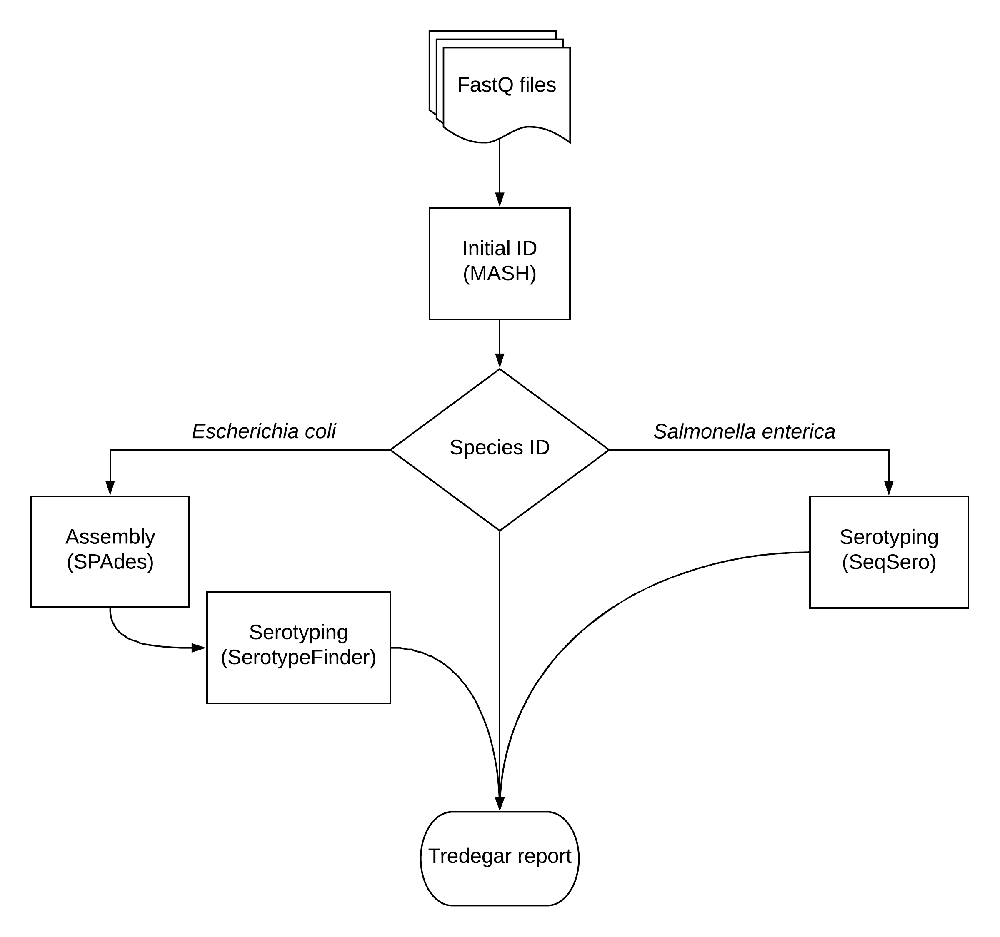

# Tredegar
A bioinformatics pipeline for organism identification and sample-label verification of whole genome sequence (WGS) data produced at the DCLS


## Rationale 


The DCLS is in need for a quality assurance pipeline to verify sample ID labels prior to publishing sequence data. 


## Data workflow:


Tredegar uses [MASH](http://genomebiology.biomedcentral.com/articles/10.1186/s13059-016-0997-x), a fast genome distance estimation algorithm, to determine the taxonomic identitity of all isolates; MASH is capable of accurate identification up to the species level. This level of resolution will suffice for organisms other than \**Salmonella* spp. and *Escherichia coli* isolates.

For *Salmonella* spp. and *Escherichia coli* isolates, serotype is determined through [SeqSero](http://jcm.asm.org/content/early/2015/03/05/JCM.00323-15) and [SerotypeFinder](http://jcm.asm.org/content/53/8/2410.full.pdf+html), respectively. 

All results are compiled into a single Tredegar report. This report can be accessed by WGS scientists to compare molecular typing results of each sample; significant incongruences are assumed to be a result of mislabeling. 

---

<sup>\*The majority of isolates sequenced at the DCLS are *Salonella* spp. and *Escherichia coli*. For this reason, verification of species does little for quality assurance. E.g. if an entire sequencing run contains *Salmonella enterica* isoaltes of different serotypes, confirming the species will not help to identify mislabeled samples within that run. </sup>


##Basic usage: 

````
$ tredegar.py <input_dir> -o <output_dir>
````

Tredegar assumes `<input_dir>` to be populated with paired-end fastq files; can also be a BaseMounted Project directory 


